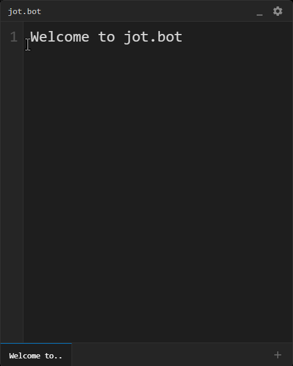

# jot.bot

**jot.bot** is a terminal-themed sticky note widget for Windows. It is built with Electron, React, and Vite.




## Features

- **Terminal Aesthetic**: Minimalist, dark-themed UI with multiple color schemes (Modern, Matrix Green, Amber, Cyber Blue).
- **CRT Effects**: Optional scanlines and flicker animation for a retro feel.
- **Workflow Friendly**:
  - **Always on Top**: Pin the widget to float above other windows.
  - **System Tray**: Runs in the background; toggle visibility via the tray icon.
  - **Widget Mode**: Shrinks to a small floating icon to save screen space.
- **Tab Management**:
  - Create multiple notes (tabs).
  - Rename tabs (double-click).
  - **Lock Tabs**: Right-click to prevention deletion.
  - **Reorder**: Drag and drop tabs to organize.
- **Customization**:
  - Toggle Line Numbers and Word Wrap.
  - Adjust font size and tab character limits.

## Installation

Download the latest `.msi` installer from the [Releases](https://github.com/yourusername/jotbot/releases) page.

## Development

### Prerequisites
- Node.js (v18+)
- npm

### Setup

```bash
# Clone the repository
git clone https://github.com/yourusername/jotbot.git

# Go into the app directory
cd jotbot/my-app

# Install dependencies
npm install
```

### Running Locally

```bash
npm run electron:dev
```

### building for Production

To build the MSI installer:

```bash
npm run electron:build
```

The output file will be in the `release/` directory.

## License

MIT
